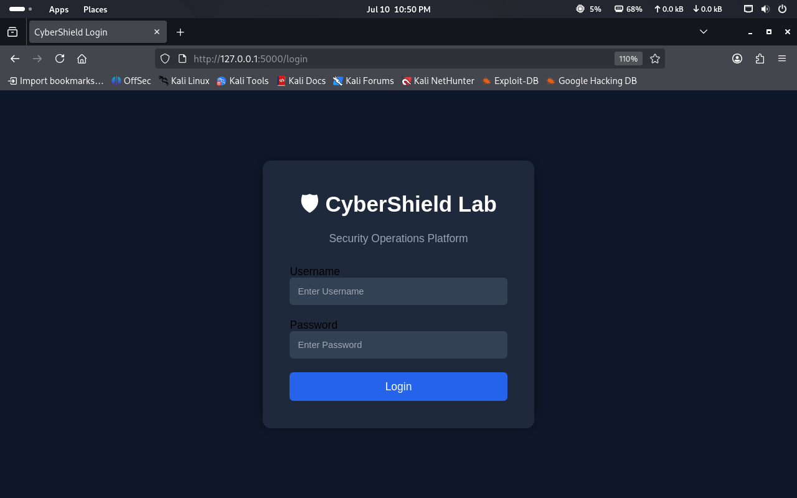
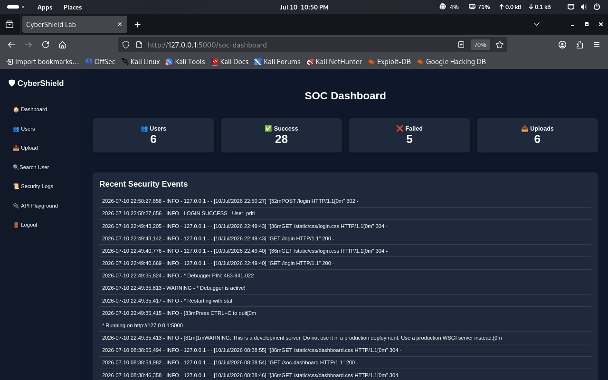
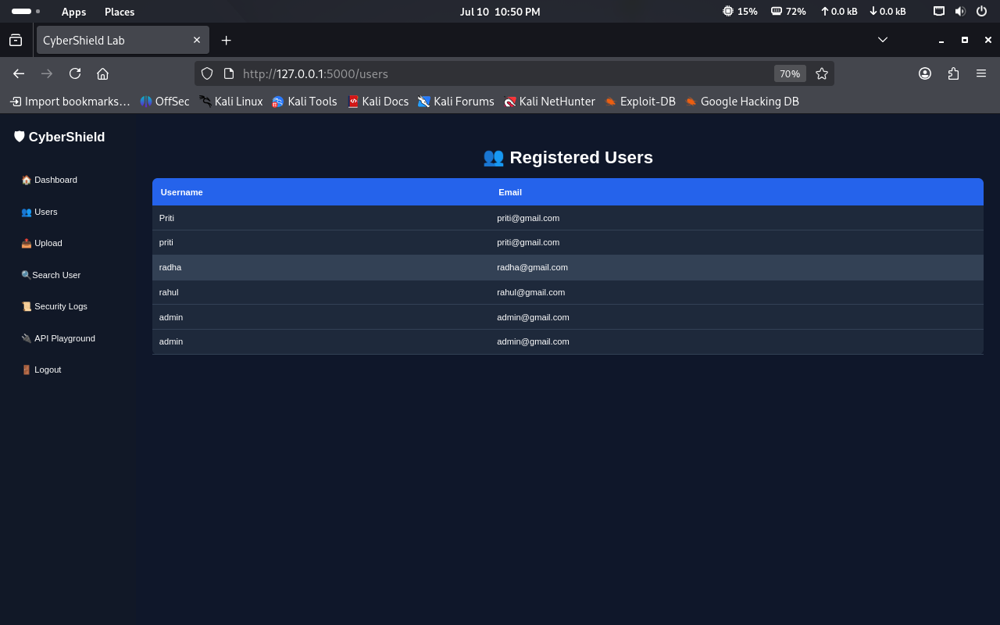
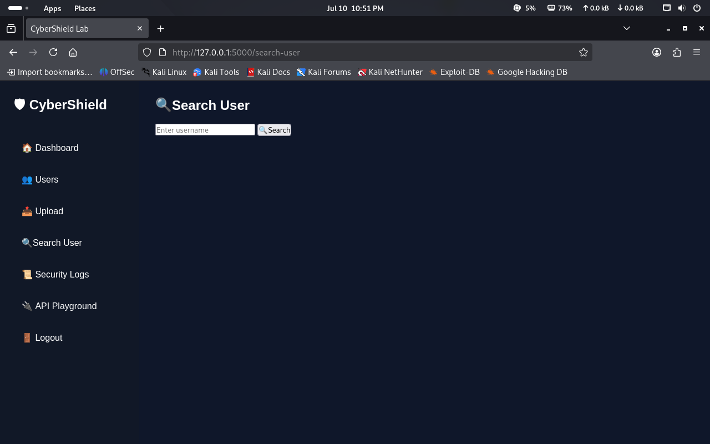
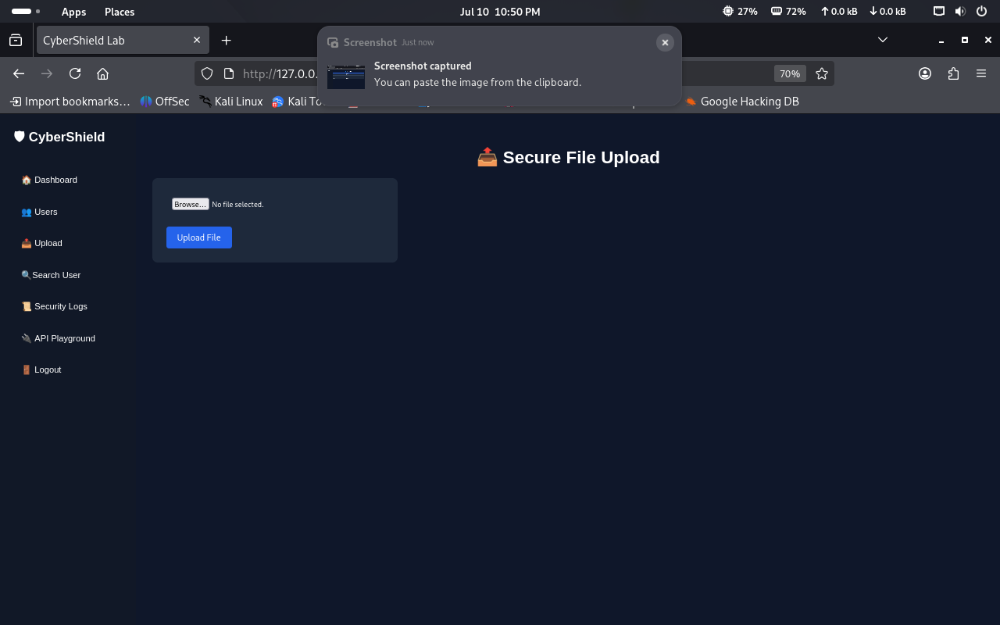
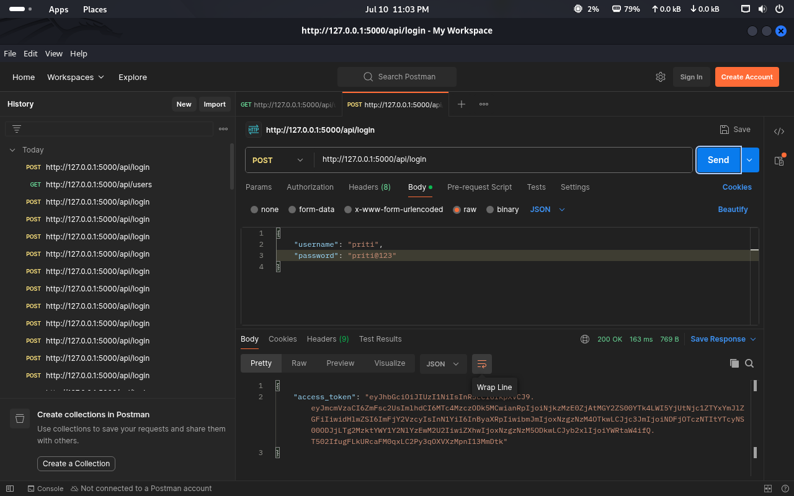

# CyberShield Lab

A Flask-based cybersecurity web application developed to demonstrate secure authentication, REST APIs, role-based access control, secure file handling, and OWASP web security concepts.

> **Purpose:** This project was built to strengthen practical cybersecurity skills for Security Analyst / SOC Analyst roles by implementing common security controls used in real-world web applications.

---

# 📸 Screenshots

## Login Page



---

## SOC Dashboard



---

## Registered Users



---

## Search User



---

## Secure File Upload



---

## JWT Authentication (Postman)



---

## Protected API Response


---

# ✨ Features

- User Registration
- Secure Login & Logout
- Password Hashing
- Session Management
- Role-Based Access Control (RBAC)
- JWT Authentication
- REST API Development
- Secure File Upload
- User Dashboard
- User Management
- Search Users
- Security Event Logging

---

# 🔒 Security Features

## Authentication

- Secure password hashing
- Session-based authentication
- JWT Authentication for APIs

## Authorization

- Role-Based Access Control (Admin/User)
- Protected routes

## Web Security

- CSRF Protection
- Security Headers
- Rate Limiting
- SQL Injection Prevention
- XSS Demonstration

## File Upload Security

- File Type Validation
- Image Verification using Pillow
- Randomized File Names
- Maximum File Size Restriction

---

# 🛠 Technologies Used

| Technology | Purpose |
|------------|----------|
| Python | Backend |
| Flask | Web Framework |
| SQLite | Database |
| HTML | Frontend |
| CSS | Styling |
| JavaScript | Client-side functionality |
| Flask-JWT-Extended | JWT Authentication |
| Flask-WTF | CSRF Protection |
| Flask-Limiter | Rate Limiting |
| Pillow | Image Validation |
| Postman | API Testing |
| Git & GitHub | Version Control |

---

# 📂 Project Structure

```
CyberShieldLab/
│
├── app.py
├── database.py
├── requirements.txt
├── README.md
│
├── templates/
│
├── static/
│   ├── css/
│   ├── js/
│   └── images/
│
├── docs/
│   └── images/
│
├── logs/
├── uploads/
│
└── view_users.py
```

---

# 🚀 Installation

Clone the repository

```bash
git clone https://github.com/Rahanepriti/CyberShield-Lab.git
```

Move into the project directory

```bash
cd CyberShield-Lab
```

Create a virtual environment

```bash
python3 -m venv venv
```

Activate the environment

Linux

```bash
source venv/bin/activate
```

Windows

```bash
venv\Scripts\activate
```

Install dependencies

```bash
pip install -r requirements.txt
```

Run the application

```bash
python app.py
```

---

# 🔑 API Endpoints

## Login

```
POST /api/login
```

Returns a JWT access token.

---

## Get Users

```
GET /api/users
```

Requires:

```
Authorization: Bearer <JWT_TOKEN>
```

---

# 🔍 Security Concepts Demonstrated

- Authentication
- Authorization
- Password Hashing
- JWT Authentication
- REST APIs
- Secure File Upload
- SQL Injection Prevention
- Cross-Site Request Forgery (CSRF)
- Cross-Site Scripting (XSS) Awareness
- Security Headers
- Rate Limiting
- Security Logging

---

# 🎯 Learning Outcomes

This project helped me gain practical experience with:

- Flask Web Development
- Secure Authentication
- API Development
- Security Best Practices
- OWASP Top 10 Awareness
- Incident Logging
- Role-Based Access Control
- Git & GitHub Workflow
- Postman API Testing

---

# 🔮 Future Improvements

- Password Reset
- Email Verification
- Two-Factor Authentication (2FA)
- SIEM Integration
- Audit Log Export
- Docker Deployment

---

# 👩‍💻 Author

**Priti Rahane**

- GitHub: https://github.com/Rahanepriti
- Project: https://github.com/Rahanepriti/CyberShield-Lab

---

## ⭐ If you found this project useful, consider giving it a Star.
